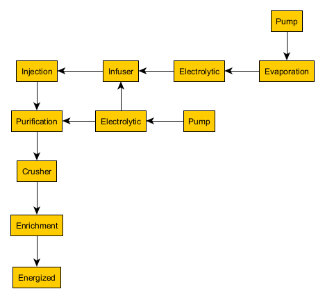
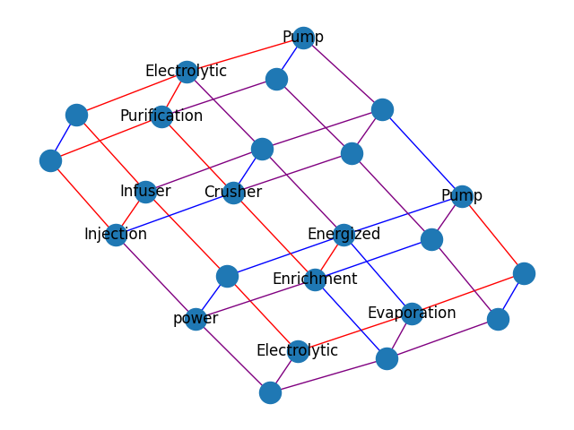
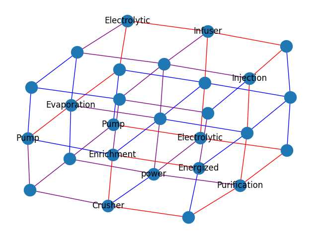

Tool that compacts modded minecraft processes into a specified 3D space. Reads in a directed graph that describes the process. Assumes all nodes in graph are machines and also require a connection to power, and that power is provided through one node inside the space (might be an inefficient assumption). Forces machines that require external input/output onto the border. 

E.g: Embed graph (Tier 4 ore processing in Mekanism) in 2x3x4 and 3x3x3

  

Note: very very very slow
